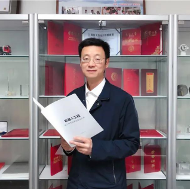

I received the M.S. degree from Nanjing Normal University, Nanjing, China, in 2021. I am currently pursuing the Ph.D degree of Nanjing University, Nanjing, China. 
My research interests included Government Bigdata,E-government,Digital Government,Community Service based on Humman Activity Recognition,Machine Learning, Deep Learning,etc. My advisor was A.P [Lei Zhang](http://d.njnu.edu.cn/person/3288.html) during my master's degree, and now my Ph.D supervisor is [Guangwei Hu](https://im.nju.edu.cn/hgw/list.htm). 

By the way, I must express my gratitude to [Stuart Geiger](https://pages.github.com) who supplied the nice academicpages template freely. 

[Map widge](https://clustrmaps.com/site/1bkl9)
========
 

CV (updating)
========
[Ch-Version](https://github.com/tengqi159/tengqi.github.io/blob/main/CV.pdf) and En-Version(updating)

     

News
====
Oct 17,2021: 
It is my first time to creat my own acadimic pages. Towards a more professional academic road!

Research Advisors 
=====

 <a href="https://im.nju.edu.cn/hgw/list.htm">Guangwei Hu</a> Professor NJU

 <a href="http://d.njnu.edu.cn/person/3288.html">Lei Zhang</a> Associate Professor NNU

 <a href="https://sites.google.com/site/hejunzz/">Jun He</a> Associate Professor NUIST

 <a href="http://www.ise.ynu.edu.cn/teacher/805">Hao Wu</a> Associate Professor YNU

 <a href="https://scholar.google.com/citations?hl=zh-CN&user=RjQ5TrEAAAAJ">Aiguo Song</a> Professor SEU

#### <strong>Schoolmates</strong>

 <a href="https://github.com/tengqi159">Qi Teng</a> Ph.D Student NJU

 <a href="https://github.com/KennCoder7">Kun Wang (Kenn)</a> Ph.D Student SEU

 <a href="https://yinntag.github.io/">Yin Tang</a> M.S Student NNU

 <a href="https://wenbohuang1002.github.io/">Wenbo Huang</a> M.S Student NNU

#### <a href="#top">[Go Back to Top]</a>
