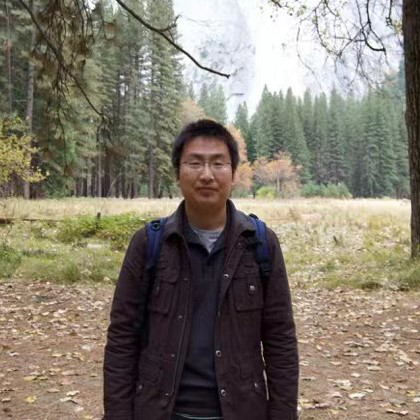

Education experience
====
Ph.D candidate of Nanjing University, Nanjing, China,2021~

M.S. degree of Nanjing Normal University, Nanjing, China, 2018-2021

Research areas
====
- E-government
- Deep Learning
- Machine Learning
- Digital Government
- Government Big Data
- Community Service based on Humman Activity Recognition

Skill
====
- python
- tensorflow,pytorch,keras,caffe

[Map widge](https://clustrmaps.com/site/1bkl9)
========

CV (updating)
========
[Ch-Version](https://github.com/tengqi159/tengqi.github.io/blob/main/CV.pdf) and En-Version(updating)

     

News
====
Oct 17,2021: 
It is my first time to creat my own acadimic pages. Towards a more professional academic road!

Research Advisors 
=====

 <a href="https://im.nju.edu.cn/hgw/list.htm">Guangwei Hu</a> Professor NJU

 <a href="http://d.njnu.edu.cn/person/3288.html">Lei Zhang</a> Associate Professor NNU

 <a href="https://sites.google.com/site/hejunzz/">Jun He</a> Associate Professor NUIST

 <a href="http://www.ise.ynu.edu.cn/teacher/805">Hao Wu</a> Associate Professor YNU

Schoolmates
=====

 <a href="https://github.com/KennCoder7">Kun Wang (Kenn)</a> Ph.D Student SEU

 <a href="https://yinntag.github.io/">Yin Tang</a> M.S Student NNU

 <a href="https://wenbohuang1002.github.io/">Wenbo Huang</a> M.S Student NNU

Top conference Paper List(Updating)
====
Standing on the shoulders of giants, walking in the academic forefront! 
 
 [CPVR2021](https://openaccess.thecvf.com/CVPR2021?day=all)
 
 [NIPS2021](https://proceedings.neurips.cc/paper/2020)

 [ICLR2021](https://openreview.net/group?id=ICLR.cc/2022/Conference)

 [ICML2021](https://openreview.net/group?id=ICLR.cc/2022/Conference)

 [ACL-IJCNLP 2021](https://2021.aclweb.org/registration/accept/)

 [AAAI 2021](https://dblp.uni-trier.de/db/conf/aaai/aaai2021.html)

 [ICCV 2021](https://openaccess.thecvf.com/ICCV2021?day=all)

 [ACM MM 20211](https://2021.acmmm.org/main-track-list)

 [NeurIPS 2021----->updting]

Acknowledgement
=====

By the way, I must express my gratitude to [Stuart Geiger](https://pages.github.com) who supplied the nice academicpages template freely. 

#### <a href="#top">[Go Back to Top]</a>

